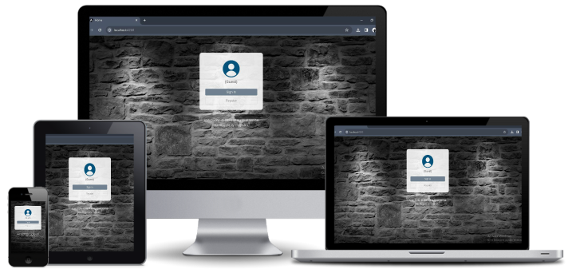

# User Profile

Managing online user profiles. This project was generated with [Angular CLI](https://github.com/angular/angular-cli) version 16.1.3.


> **Angular 2+** -  The most powerful javascript framework widely used for process real-time data. 

## Table of contents

- [Description](#description)
- [How to use](#how-to-use)
- [References](#references)
- [Licence](#licence)
- [Author Information](#author-information)


## Description

User Profile is single-page application developed with `Angular 2+` framework. The application allows anonymous user to create profile (`registrastion`), and login into the system (`authentication`) to view their login attempts (failed and passed) metrics. 

[Back to the top](#user-profile)

## Tools and Technologies

[Back to the top](#user-profile)

#### Responsive Wed Design
- Responsive Web Design (HTML 5, CSS 3, Bootstrap 5).
- Angular CLI - ver 16.1.8
- Visual Studio Code.
- Angular/Typescrit framawork ver - 16.2.12
- Node.js - ver 18.13.0
- Json server (Mock API) - ver 1.0.0-alpha.23
- Postman - for testing http methods.
- Karma and Jasmine.

## How to use

#### 1. Installation
You need the following tools installed on your computer before attempting to run the cloned project:

- Visual Studio Code
- Node.js
- NPM (Node Package Manager)
- Angular CLI

#### 2. Clone `GitHub` project repository

The GitHub repository for this project can be accessed by clicking here: [ [User Profile](https://github.com/my-recent-projects/Prj-User-Admin) ]. For more information on how to clone the GitHub repository, see ["Cloning GitHub repository"](https://docs.github.com/en/repositories/creating-and-managing-repositories/cloning-a-repository).

#### 3. Run Project

Before running the project, copy the command below, pasted it in your angular CLI, the hit `Enter` button. This step will install all the packages required before running the project.
```javascript
npm install
```
To run the project, copy the command below, pasted it in your angular CLI, the hit **Enter** button. This step will install all the packages required before running the project.
```javascript
ng serve
``` 
Once the project is running, navigate to `http://localhost:4200/` or copy the hyperlink and paste in your browser address bar, then run. 

#### 4. API Reference
This application uses `json-server` Mock API to mimic real JSON RESTful services. To run json-server for this application, you need to run the following command:

```javascript
npm run api
``` 

Please read [ json-server documentation](https://github.com/typicode/json-server) mock API for more details.

#### 5. Run the Units Test
To run the units test [Karma](https://karma-runner.github.io), please execute the commend in your angular CLI as indicated below:
```javascript
ng test
``` 

[Back to the top](#user-profile)

## References

- For more information related to Angular setup, please check out the [Angular documentation](https://angular.io/docs) page.
- For more information related to Angular CLI, please check out the [Angular CLI Overview and Command Reference](https://angular.io/cli) page.
- For more information related to Node.js, please check out the [Introduction to Node.js](https://nodejs.org/en/learn/getting-started/introduction-to-nodejs) page.
- For more information related to Node Package Manager (NPM), please check out the [npm Docs](https://docs.npmjs.com/) page.


[Back to the top](#user-profile)

## Licence

MIT License

Copyright (c) [ 2024 ] [ Yingisani Chiqinda ]

Permission is hereby granted, free of charge, to any person obtaining a copy of this software and associated documentation files (the "Software"), to deal in the Software without restriction, including without limitation the rights to use, copy, modify, merge, publish, distribute, sublicense, and/or sell copies of the Software, and to permit persons to whom the Software is furnished to do so, subject to the following conditions:

The above copyright notice and this permission notice shall be included in all copies or substantial portions of the Software.

THE SOFTWARE IS PROVIDED "AS IS", WITHOUT WARRANTY OF ANY KIND, EXPRESS OR IMPLIED, INCLUDING BUT NOT LIMITED TO THE WARRANTIES OF MERCHANTABILITY, FITNESS FOR A PARTICULAR PURPOSE AND NONINFRINGEMENT. IN NO EVENT SHALL THE AUTHORS OR COPYRIGHT HOLDERS BE LIABLE FOR ANY CLAIM, DAMAGES OR OTHER LIABILITY, WHETHER IN AN ACTION OF CONTRACT, TORT OR OTHERWISE, ARISING FROM, OUT OF OR IN CONNECTION WITH THE SOFTWARE OR THE USE OR OTHER DEALINGS IN THE SOFTWARE..

[Back to the top](#user-profile)
